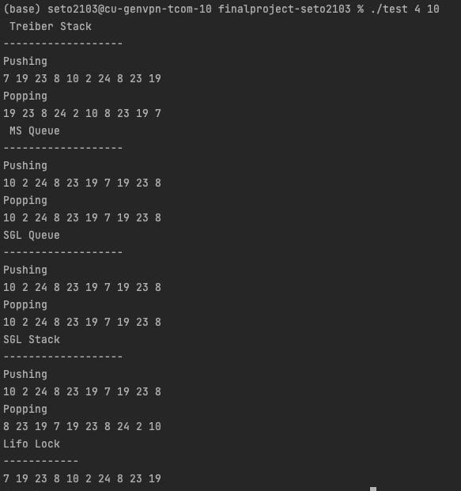

# Final Project - Sebastian Torres
## CSCI 4313 - Concurrent Programming 

## Summary:

For the final project I decided to try to implement the concurrent containers. I was successful in my implementation but
failed to implement an eliminiation for my stacks. I also attempted to create a lifo lock per the recommendation of the 
README of combining a MSC with a stack, that has some bugs in it.

## IMPORTANT- USAGE INSTRUCTIONS
    Make command will create two executables. test and concurrent_data_struct
    Usage: ./concurrent_data_struct [--name] [-h] [-t NUM_THREADS] [-v TESTING_VECTOR_SIZE] [--alg=<treiber,sglstack,sglqueue,msqueue,lifolock>] [--testing=<true,false>]
    Usage Example : ./concurrent_data_struct -t 10 -v 500 -alg=sglstack --testing=true 
    Usage Example: ./concurrent_data_struct -alg=sglqueue
    Only flag that is actually needed is the --alg one
    All else has defaults set if not given

    Flags:
    --name will just print out my name
    -h will print the Usage message
    -t is the number of threads you'd like, 4 is default
    -v is the size of the vector we want to use, # of transactions will be 2 * vector size, as the vector gets pushed then all popped
    -v default is 20 
    --alg is deciding the algorithm you'd like to run
    --testing detemrines if output should be printed or not, default is false

    Usage: ./test threads vector_size
    Much less sophisticated argument passing 
    Will always print output, and will run through all algorithms
    Usage Example : ./test 5 30
    Flags:
    First number is the number of threads we want
    Second number is the vector size we want

## Code Organization
I did my best to make my code easy to go through. Each algorithm has their own cpp and hpp file with the name of the 
algorithm as the name of the file. We have a couple helper files such as test_helpers, read_write, and test.

- lifo_locks.*pp - lifo implementation
- main.cpp - main driver file 
- test.cpp - file used to test all algorithms
- sgl_queue.*pp - SGL queue implementation
- sgl_stack.*pp - SGL stack implementation
- read_write.*pp - read/write from text files
- treiber.*pp - Treiber implementation
- ms_queue.*pp - MS Queue implementation
- MakeFile - make file as the name says 
- test_helpers.*pp - helper functions for testing 

## File Descriptions

### main.cpp:
This is my main driver file that should hopefully make grading a bit easier. It has the ability to run my algorithms
thorugh command line arguments. Mostly pulled from Lab 3.

### test.cpp:
This will run all the algorithms at once, it defaults to 4 threads, using a vector of size 20, it outputs the popping and pushing
for the algorithms. 

### sgl_queue.*pp:
This is the implementation for SGL queue. It is very simple, when you pop or push you lock the queue, run your process, and
then unlock.

### sgl_stack.*pp:
This is the implementation for SGL stack. It is very simple, when you pop or push you lock the stack, run your process, and
then unlock.

### treiber*.pp:
This is the implementation for the treiber algorithm implemented from lecture slides. 

### ms_queue.*pp:
This is the MS queue, it has been implemented from lecture slides.

### lifo_locks.*pp:
This my attempt at a lifo lock. I implemented a MSC algorithm but instead of using a queue, I attempted to use a stack to 
make it be lifo, it has some bugs. It hangs at times. 

### testing_helpers.*pp:
This is some simple helper functions. Depending on what algorithm was called, the threads enter one of these functions, run
the processes, and return. Has boolean variables to determine if output should be printed to stdout. 

### read_write.*pp:
Basically just used the print_usage from this, nothing more. From previous labs. 

## Experimental Results 

### Time

2500 push +  2500 pops = 5000 operations w/5 threads

| Treiber(s)        | SGL Stack(s) | SGL Queue(s) | MS Queue(s)    |
|-------------------|--------------|--------------|----------------|
 | 0.023667193       | 0.027275770  | 0.023695949  | 0.020296809    |
 | 0.027732147       | 0.019808280  | 0.019612571  | 0.019404405    |
| 0.018906338       | 0.028163293  | 0.023464651  | 0.004937932    |
 | Avg: 0.0226801882 | 0.02071117287 | 0.022334823  | 0.01487971533  |

2500 push +  2500 pops = 5000 operations w/25 threads

| Treiber(s)        | SGL Stack(s) | SGL Queue(s) | MS Queue(s)    |
|-------------------|--------------|--------------|----------------|
| 0.031645512      | 0.052501264  | 0.006013977  | 0.009014132    |
| 0.030878715      | 0.007282477  | 0.043206751  |  0.025232308    |
| 0.023292127      | 0.020488928  | 0.031833853  | 0.023894957    |
| Avg: 0.02860545133 | 0.02675755633 | 0.02701819367  | 0.01938046567  |

2500 push +  2500 pops = 5000 operations w/100 threads

| Treiber(s)        | SGL Stack(s) | SGL Queue(s) | MS Queue(s)    |
|-------------------|--------------|--------------|----------------|
| 0.025871033       | 0.019302840  | 0.049384775  | 0.034341033    |
| 0.017868520       | 0.043086279   | 0.044710509  | 0.038508755   |
| 0.002525192       | 0.052743424  | 0.017702198  | 0.018793568    |
| Avg: 0.01542158167 | 0.03837751433 | 0.03726582733  | 0.03054778533  |

### Rates

2500 push +  2500 pops = 5000 operations w/5 threads
Avg for 3 runs

| Algorithm | L1 cache hit(%) | Branch Pred Hit Rate (%) | Page Fault Count (#) |
|-----------|-----------------|--------------------------|----------------------|
| Treiber   | 6.15            | 97.00                    | 180                  |
| SGL Stack | 6.96            | 96.82                    | 165                  |
| SGl Queue | 6.47            | 96.7                     | 164                  |
| MS Queue  | 6.83            | 96.73                    | 180                  |

2500 push +  2500 pops = 5000 operations w/25 threads
Avg for 3 runs

| Algorithm | L1 cache hit(%) | Branch Pred Hit Rate (%) | Page Fault Count (#) |
|-----------|-----------------|--------------------------|----------------------|
| Treiber   | 9.41            | 96.56                    | 331                  |
| SGL Stack | 9.47            | 96.61                    | 270                  |
| SGl Queue | 9.39            | 96.29                    | 271                  |
| MS Queue  | 8.31            | 96.51                    | 324                  |

2500 push +  2500 pops = 5000 operations w/100 threads
Avg for 3 runs

| Algorithm | L1 cache hit(%) | Branch Pred Hit Rate (%) | Page Fault Count (#) |
|-----------|-----------------|--------------------------|----------------------|
| Treiber   | 7.84            | 97.64                    | 812                  |
| SGL Stack | 10.54           | 97.5                     | 706                  |
| SGl Queue | 10.51           | 97.6                     | 696                  |
| MS Queue  | 8.79            | 97.77                    | 798                  |

It seems to be the case that the MSQueue is much faster than the rest of the algorithms. It has overall lessL1 cache hit, and a greater branch pred hit rate.

## Sample Output of Test Exe

As you can see from the image below, running 4 threads, vector of size 10. We get the right results.
Everything popped from stacks is reverse of how it was entered and stack pop are the same as the push. 
As it should be. Lifo lock ran, vector of vectors got written into just one vector using multiple threads. 

## Bugs:
Lifo lock hangs at times